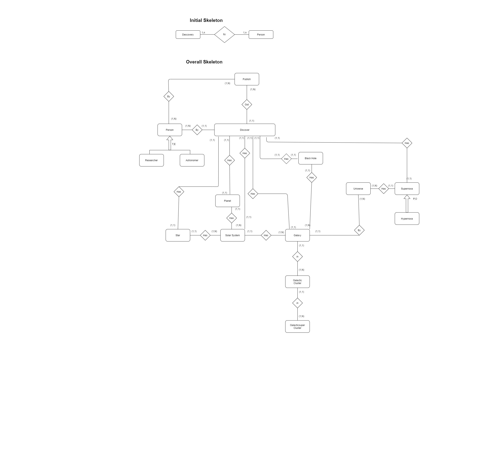
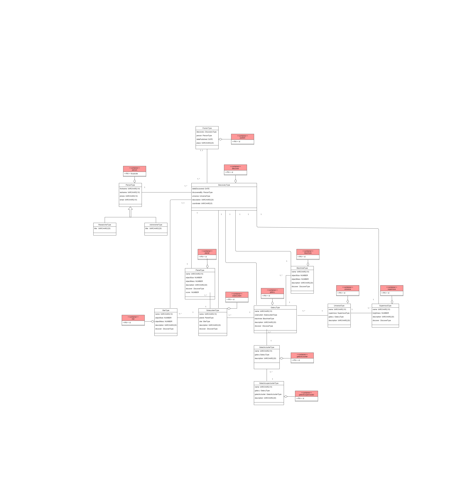
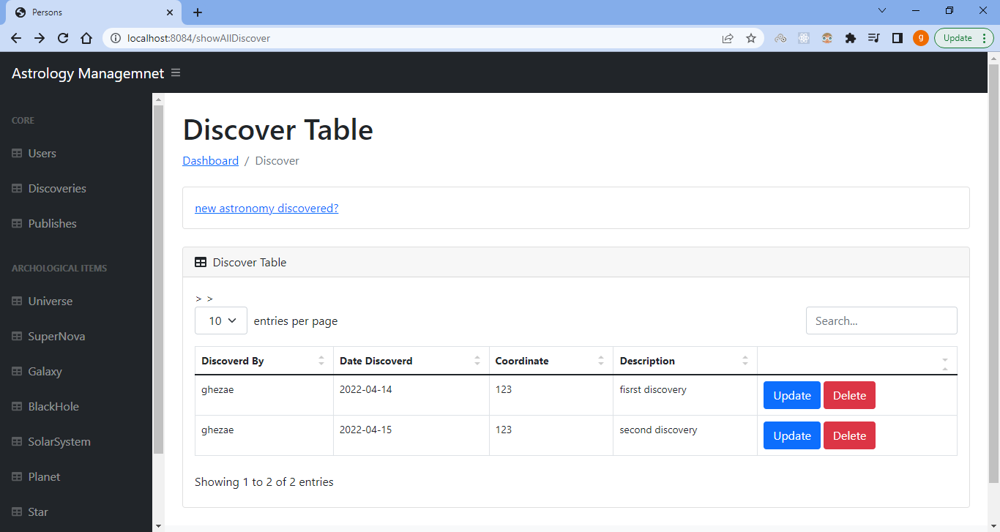

# 🌌 Astronomy Agency Consortium – Astronomical Discovery System

A comprehensive academic project developed to manage and maintain records of astronomical discoveries such as **planets**, **stars**, **solar systems**, **galaxies**, **supernovae**, and **black holes**.

This project models a complex universe of celestial entities using **nested object structures** and integrates a **web-based application** using **Spring Boot + Hibernate (JPA)** for persistence and interaction.

---

## 🚀 Project Summary

The goal of the Astronomy Agency Consortium is to:

- Store and organize diverse types of astronomical discoveries
- Track metadata like the astronomer, date of discovery, and coordinates
- Handle nested relationships between solar systems, galaxies, and universes
- Associate each discovery with scientific publications and their authors
- Enable future extensibility for real-world astronomy data systems

---

## 🌌 System Architecture

The system models astronomical entities in a hierarchy that includes:

- **Planets** with size, mass, and habitability score
- **Stars** and **Black Holes** (including supermassive classification)
- **Supernovae** (including hypernovae classification based on brightness)
- **Solar Systems** containing planets and stars
- **Galaxies** that group solar systems and black holes
- **Galactic Clusters** and **Superclusters**
- **Observable Universes** that group everything above
- **Publications** that cite and document discoveries

Each entity is linked to a discovery, and every discovery is associated with a person or group of authors (researchers/astronomers).

---

## 🖼️ Visual Data Model

The conceptual and logical designs are shown below. These diagrams demonstrate the nested structure of the astronomical system and its key components.

<p align="center">
  
  
</p>

---

## ⚙️ Application Architecture

This project is built with a clean separation of concerns, using the following components:

- **Spring Boot**: Core backend framework
- **Hibernate / JPA**: Object-relational mapping from Java classes to nested database types
- **Spring MVC**: For controller logic and REST endpoints

The application uses **ORM (Object Relational Mapping)** to map Java classes like `Planet`, `Galaxy`, or `Supernova` to their corresponding nested database tables.

---

## 🧪 Populated Data Procedures

The backend includes procedures to populate key entities such as:

- `PopulatePerson`: Load astronomers and researchers
- `populatePublish`: Load publications with discovery references
- `PopulateUniverse`: Insert a universe with all nested structures
- `PopulateGalacticSuperCluster`: Load superclusters and subclusters

---

## 🌐 Example Use Cases

- Query all planets with a habitability score above 80%
- List all supernovae classified as hypernovae
- Trace which astronomer discovered a specific black hole
- Retrieve all publications associated with a given solar system

---
## 🚀 User Interface



## 📂 Project Structure
```bash
📦 astronomy-Spring/
┣ 📁 img/
┣ 📄 README.md
┣ 📄 application.properties
┣ 📁 src/
┃ ┣ 📁 model/
┃ ┣ 📁 controller/
┃ ┣ 📁 repositry/
┃ ┣ 📁 service/
┃ ┗ 📄 MainApp.java
